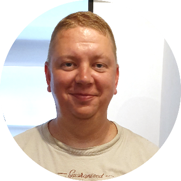

<!-- ===== HEADER ===== -->
<table>
  <tr>
    <td width="120">
      
    </td>
    <td>
      <h1>Roman Stepanov</h1>
      

        Mjölvägen 8, 247 55 Dalby, Sweden 
        📧 <a href="mailto:roman.stepanov@beltandbraces.se">roman.stepanov@beltandbraces.se</a> 
        📞 +46 76 76 211 21 
        🔗 <a href="https://www.linkedin.com/in/roman-stepanov-31823a62/">LinkedIn</a>
      

    </td>
  </tr>
</table>

---

## Objective

**Senior Software Developer** with 25+ years of experience across **embedded and system-level development** — from OS/2 device drivers to AOSP, automotive HPCUs, and AI accelerators on wearables.
Specialist in **deep debugging and root-cause analysis** of complex, low-level, and safety-critical problems that others struggle to crack.
Equally effective as an independent expert consultant and as a full member of cross-functional teams.

---

## Professional Experience

### Sigma Connectivity AB — Lund, Sweden
**Senior Software Engineer (Consultant)**
*Jan 2025 – Present*

- **Consolidating several legacy data-collection variants into one unified, multi-platform telemetry system** — eliminating duplicated per-device pipelines and putting both legacy and new wearables on a common interface
- **Migrated the telemetry codebase from AOSP 14 to AOSP 16** and onboarded existing devices onto the new system
- Develop and maintain **AOSP telemetry services across multiple wearable device families**, capturing application events for device/service health monitoring and debugging
- Engaged as an **external consultant** to a ~5-person core team, resolving cross-cutting problems across the codebase
- Accelerated development and improved code quality with **AI-assisted tools** (Claude, OpenAI ChatGPT, GitHub Copilot)

**Tools:** AOSP, Clang, LLDB, Soong, Python

---

### Volvo Cars — Lund, Sweden
**Senior Software Developer (Consultant)**
*Dec 2023 – Jan 2025*

- **Delivered performance-evaluation and debugging tooling for the car's two High Performance Computing Units (HPCU)**, giving the team visibility into per-process CPU time, memory, and core scheduling — to confirm compute headroom and speed up failure diagnosis
- **Enabled regression and trend tracking across system versions** by making captured sessions (*bundles*) directly comparable release over release
- **Surfaced hidden performance issues** through graphical views of boot-time process startup (key to fast vehicle wake-up), per-second per-process CPU, and system events — e.g. pinpointing a process that spiked CPU whenever a car door opened
- Integrated as a **full member of a 4-person team** (external consultant)

**Architectures:** AArch64, ARM, NVIDIA Drive OS, BlackBerry QNX
**Tools:** GNU C/C++, Python, Momentics IDE, PostgreSQL, Plotly

---

### Sigma Connectivity AB — Lund, Sweden
**Senior Software Developer (Consultant) — R&D for Meta**
*Jun 2022 – Dec 2023*

- **Provided the performance and power data that drove the platform's performance-vs-cost decision**, showing SRAM delivered the best NPU performance but at the highest cost
- **Benchmarked NPU inference speed across memory configurations** using a compact keyword-spotting model as a proxy for the target EMG hand-gesture model
- **Established repeatable methods for measuring NPU performance and power** under a tight wearable power budget
- **Compiled and optimized models for the ARM Ethos-U NPU** with the Vela compiler
- Software engineer in a 6-person team (3 hardware, 3 software); R&D for Meta on a wearable **EMG muscle-signal sensor** for hand-gesture recognition

**Architectures:** AArch64, ARM, ARM Ethos-U, Qualcomm Slate
**Tools:** GNU C/C++, J-Link, JTAG, nRF Power Profiler, Vela compiler, TensorFlow, Python

---

### Sigma Connectivity AB — Lund, Sweden
**Senior Software Developer (Consultant) — for Meta**
*Jun 2021 – Jun 2022*

- **Enabled the customer to benchmark inference performance across different models** by building performance-evaluation tooling for the AI hardware (APU) on a **computer-vision / AR wearable**
- **Exposed previously invisible system behavior** with new systrace metrics derived from kernel ftrace events
- **Ported OpenCV libraries and Android samples** to customer platforms

**Architecture:** AArch64
**Tools:** C/C++, Python, TensorFlow, PyTorch, Caffe2, Perfetto, Systrace, Git

---

### Sigma Connectivity AB — Lund, Sweden
**Senior Software Developer**
*Mar 2019 – Jun 2021*

- **Delivered the factory test-and-calibration backend for a Microsoft dual-screen Android tablet**, catching defects on the China production line before OS flashing and preventing scrapping of finished units
- **Shipped calibrated, tightly synchronized dual displays** — e.g. a map drags and re-renders in sync across both screens
- **Enabled direct display control** by modifying the DSI driver to issue DSI commands from an application, combining SurfaceFlinger with FTM-mode display enabling to render to both panels
- **Built display tests** for RGB color reproduction, image rendering, and calibration (positioning offset, brightness, dual-display sync), plus temperature-sensor verification
- **Sped up bring-up and triage for the whole team** with a post-boot diagnostic home screen showing all sensor states and debug information
- Developer in a large team of 20–30

**Architecture:** Qualcomm MSM89xx
**Tools:** C/C++, Python, Bash, PowerShell, Git, Azure DevOps, GDB

---

### Axis Communications — Lund, Sweden
**Senior Software Developer**
*Aug 2018 – Mar 2019*

- **Enabled pre-silicon bootloader debugging for a brand-new platform** by implementing QEMU models of peripherals (I2C, Flash) from device specs with correct port and memory-map addressing — before hardware existed
- **Resolved Axis-specific and Linux mainline kernel issues** (filesystem, sensors) through bug fixing, crash-dump analysis, and board bring-up
- Developer in a ~10-person team working on surveillance-camera platforms

**Platforms:** ARM9, ARM11, MIPS
**Tools:** GNU C/C++, Python, Bash, GDB, Crash, QEMU

---

### TerraNet AB — Lund, Sweden
**Senior Software Developer**
*Aug 2017 – Aug 2018*

- **Proved the 3M concept viable** — ~10 Wi-Fi-mesh headset / walkie-talkie units operating simultaneously — by bringing power and CPU usage within budget
- **Stripped a heavyweight Android wearable platform to its essentials** (removed SurfaceFlinger and other unneeded services) while preserving the framework audio path required by the Java demo app
- Brought in as the **Android expert** for CPU optimization and power saving

**Architecture:** AArch64
**Tools:** C/C++, Java, Python, Bash, GDB

---

### Sigma Connectivity AB — Lund, Sweden
**Senior Software Developer**
*Jul 2015 – Aug 2017*

**Project:** *Solarin* (Sirin Labs) — ultra-secure luxury Android smartphone

- **Took ownership of Wi-Fi and WiGig (802.11ad) and drove the device to Wi-Fi Alliance certification** — achieved on-site in Spain after supporting test runs in the US
- **Integrated WiGig (802.11ad)**: firmware loading, wpa_supplicant bring-up, and Wi-Fi/WiGig coexistence within Android's constraints
- **Eliminated full-device reboots** by implementing subsystem-restart / ramdump recovery — so the phone never reboots in a user's pocket and stalls at the PIN screen, risking a missed call
- **Unblocked automated certification testing** by fixing the adb-forwarding DUT agent that connected to the test lab's control unit
- Configured the **Qualcomm RF front-end** (antenna/PA tuning across LTE bands via MBNs) and MIPI; handled crash-dump analysis and Android stability (ANRs, crashes)
- Developer in a team of ~30

**Architecture:** Qualcomm MSM8994
**Tools:** C/C++, Java, Python, Bash, QXDM, QPST, Gerrit, Trace32, GDB

---

### Sony Mobile Communications / Sony Ericsson — Lund, Sweden
**Senior Software Engineer**
*Jun 2008 – Jul 2015*

Member of **MIB (Men In Black)** — an interview-and-test-gated elite troubleshooting team owning all functionality on specific phone series (~10 engineers per series, including a dedicated power-saving subteam) for mass-market handsets with per-country and per-operator customizations.

- **Saved a large handset order** by root-causing broken video streaming for an Israeli operator — through deep code analysis and diffing against a newer series where it could not be reproduced
- **Pinpointed memory leaks and accidental duplicate object instances** by building a memory-usage tracker (custom `malloc`/`free` macros instrumented with `__FILE__`/`__LINE__`, parsed from logs into allocation/free statistics)
- **Made modem-related crashes classifiable** with a debug tool that recorded modem logs into a ring buffer, retrievable on crash
- **Co-developed a GDB plugin** exposing Java backtraces and objects per thread inside native crash dumps
- **Tamed massive memory corruption, leaks, and watchdogs** rooted in the EMP platform (Ericsson Mobile Platform, OSE-based) having dropped the MMU, which let any code — including user apps — access any memory
- Worked at **senior level throughout**, supporting and supervising fixes across many teams

**Architectures:** Qualcomm MSMxxxx, OSE, ST-Ericsson, Broadcom, OMAP4
**Tools:** C/C++, Java, Python, Bash, Trace32, GDB, Jira

---

### Accenture Nordics — Riga, Latvia
**Senior System Analyst**
*2006 – 2008*

- **Proved from a crash dump — using register contents and disassembled code — that a failure was caused by a bit-flip from overheating**
- **Owned TFTP/BOOTP and ATM interfaces** on **IPSO** (the FreeBSD-based OS for firewall appliances), alongside broad bug fixing and crash-dump analysis
- Outsourcing project for **Nokia**, later **Nokia Siemens Networks**; ~15-person team

**Architectures:** FreeBSD 3.6, Linux
**Tools:** C/C++, Python, Bash, TCL/TK, GDB, IXIA, CVS

---

### Exigen Group (Software House Technology) — Riga, Latvia
**Senior Developer**
*1998 – 2006*

- **Fully rewrote the PCMCIA stack** (Socket Services / Card Services) and **added CardBus support**, modifying PCI drivers to dynamically configure CardBus adapters
- **Enabled IBM Ethernet 10/100, Token Ring, and USB 2.0 CardBus adapters on IBM ThinkPad**
- Shipped **OS/2 device drivers for IBM** across OS/2 Warp 4 Convenience Package, Warp 4 Server CP, OS/2 Aurora (CP), and Fix Paks, for IBM PS/2 servers and ThinkPad
- Grew from **test engineer to Advanced Software Developer**; team of ~10

**Architecture:** Intel x86
**Tools:** Microsoft C++, MASM, Watcom C++, IBM VisualAge, CMVC

---

## Education

**Riga Aviation University** — Faculty of Radioelectronics and Computer Systems
*1994 – 1998 (4 years of studies)*

---

## Skills

- **Programming Languages:** C / C++ (26+ years), Python, Java, x86 / ARM assembly, TCL/TK
- **Operating Systems:** Linux / Unix (20+ years), Android / Android Wear / AOSP (12+ years), FreeBSD, AIX, Solaris, OS/2
<<<<<<< HEAD
- **Real-Time / Embedded OS:** BlackBerry QNX, NVIDIA Drive OS, OSE
- **Debugging & Root-Cause Analysis:** GDB, LLDB, Trace32, Ozone J-Link, Crash; crash-dump & ramdump analysis; memory-corruption and leak hunting
- **Tracing & Profiling:** Perfetto, Systrace, kernel ftrace, nRF Power Profiler; performance & power profiling
=======
- **Real-Time / Embedded OS:** BlackBerry QNX, NVIDIA Drive OS, OSE, Free RTOS, Zephyr
- **Debugging & Root-Cause Analysis:** GDB, LLDB, Trace32, Ozone J-Link, Crash; crash-dump & ramdump analysis; memory-corruption and leak hunting
- **Tracing & Profiling:** Perfetto, Systrace, kernel ftrace, nRF Power Profiler; performance & power profiling, PicoScope
>>>>>>> d1c5c7e (Updating resume and rendering scripts)
- **Low-Level & Drivers:** Linux kernel, device drivers, board bring-up, bootloaders, DSI / MIPI, I2C, PCMCIA / CardBus, USB, PCI
- **Connectivity:** Wi-Fi, WiGig (802.11ad), LTE / modem (QXDM, QPST), TFTP/BOOTP, ATM
- **AI / Hardware:** ARM Ethos-U NPUs, NPU / APU evaluation, TensorFlow, PyTorch, Caffe2, Vela compiler, OpenCV
- **Emulation & Virtualization:** QEMU
- **Build & Version Control:** Soong, Make / CMake, Git, Gerrit, Azure DevOps, CVS, CMVC; JTAG, J-Link
- **Currently exploring:** Verilog / FPGA development

---

## Interests

- Electronics
- Shortwave amateur radio
- Software-defined radio (SDR)

---
