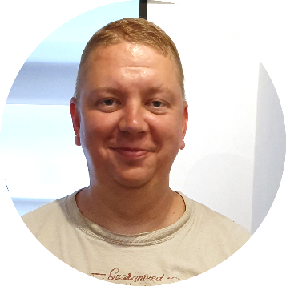

<!-- ===== HEADER ===== -->
<table>
  <tr>
    <td width="110">
      
    </td>
    <td>
      <h1>Roman Stepanov</h1>
      

        Dalby (Lund municipality), Sweden 
        📧 <a href="mailto:roman.stepanov@beltandbraces.se">roman.stepanov@beltandbraces.se</a> |
        📞 +46 76 76 211 21 
        🔗 <a href="https://www.linkedin.com/in/roman-stepanov-31823a62/">LinkedIn</a>
      

    </td>
  </tr>
</table>

---

## Profile

Senior Software Engineer with **25+ years of experience** in **embedded systems, Android, Linux kernel and low-level debugging**.  
Strong background in **automotive, telecom, AI acceleration and performance analysis**.  
Used to working in **complex, safety-critical and cross-functional environments**.  
Available for **B2B consulting or employment**.

---

## Key Competencies

- Embedded Linux & Android (AOSP, BSP, system services)
- Low-level debugging & root-cause analysis
- Automotive platforms (QNX, NVIDIA Drive OS)
- Performance & power profiling
- Kernel, drivers, system bring-up
- AI HW / NPU evaluation

---

## Professional Experience

### Sigma Connectivity AB — Lund  
**Senior Software Engineer**  
*Jan 2025 – Present*

- Development and maintenance of **vendor-specific telemetry services in AOSP**
- Migration to a **unified multi-platform telemetry architecture**
- Close collaboration with platform, system and application teams

**Tech:** AOSP, Clang, LLDB, Soong, Python  

---

### Volvo Cars  
**Senior Software Developer**  
*Dec 2023 – Jan 2025*

- Tools for **performance evaluation and debugging**
- Work on **automotive-grade platforms**

**Platforms:** ARM / AArch64, NVIDIA Drive OS, QNX  
**Tech:** C/C++, Python, PostgreSQL, Plotly  

---

### Sigma Connectivity AB  
**Senior Software Developer**  
*2019 – 2023*

- R&D projects in **AI acceleration and performance evaluation**
- Measurement of **NPU performance and power consumption**
- Development of tracing and profiling tools
- Display stack, factory automation, system diagnostics

**Platforms:** ARM, ARM Ethos-U, Qualcomm  
**Tech:** C/C++, Python, TensorFlow, Perfetto, Systrace, OpenCV  

---

### Axis Communications  
**Senior Software Developer**  
*2018 – 2019*

- Linux kernel development for **secure camera platforms**
- Device drivers, kernel debugging, QEMU models

**Tech:** C/C++, GDB, QEMU  

---

### TerraNet AB  
**Senior Software Developer**  
*2017 – 2018*

- Concept project: **Voice-over-Mesh communication devices**
- System performance, power optimisation
- Linux kernel and Android framework debugging

---

### Sony Mobile Communications / Sony Ericsson  
**Senior Software Engineer**  
*2008 – 2015*

- Member of **MIB (Men In Black)** troubleshooting team
- Investigation of **critical system issues**: memory corruption, watchdogs
- Development of internal debugging tools
- Support and supervision across multiple teams

**Platforms:** Qualcomm, OMAP, Broadcom, OSE  

---

## Education

**Higher Technical Education**  
Software Engineering / Computer Systems

---

## Technical Skills

- **Languages:** C, C++, Python, Java  
- **OS:** Linux, Android, FreeBSD  
- **Debugging:** GDB, Trace32, J-Link  
- **Tools:** Git, Gerrit, Perfetto, QEMU  
- **Architectures:** ARM, AArch64, x86  

---

## Languages

- English — Fluent  
- Swedish — Working proficiency  
- Russian — Native  

---

